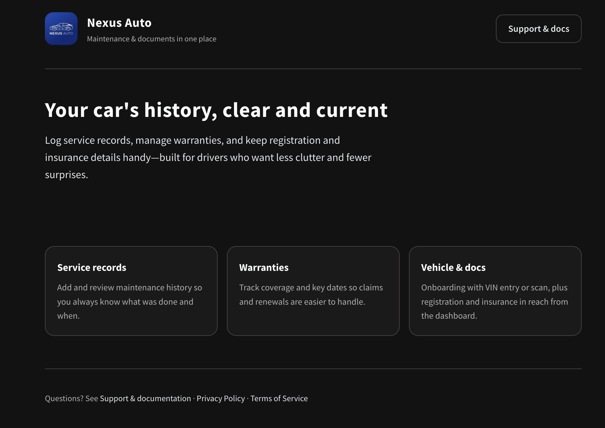

# Nexus Auto — Landing site

Static marketing pages for **Nexus Auto**, a product concept focused on organizing vehicle maintenance: service records, warranties, registration, and insurance in one place.

<p align="center">
  
</p>

## What’s in this repo

| File / folder  | Purpose                                                                              |
| -------------- | ------------------------------------------------------------------------------------ |
| `index.html`   | Landing page with hero, feature highlights, and links to support.                    |
| `support.html` | Support content, documentation-style guidance, Privacy Policy, and Terms of Service. |
| `assets/`      | `icon.png` (header), `favicon.png` (tab icon), `screenshot.png` (README preview).    |

There is no build step or package manager: open the HTML files in a browser or serve the folder with any static file server.

## Run locally

**Option A — open the file**

Double-click `index.html` or open it from your browser. Use `support.html` for the support and legal pages.

**Option B — local server** (recommended so paths and behavior match deployment)

From the project root:

```bash
python3 -m http.server 8080
```

Then visit [http://localhost:8080](http://localhost:8080).

Alternatively, with Node.js:

```bash
npx --yes serve .
```

## Tech stack

- Semantic HTML5
- CSS custom properties (theme colors, spacing) and inline `<style>` blocks
- [Source Sans Pro](https://fonts.google.com/specimen/Source+Sans+Pro) via Google Fonts

## Deploy

Upload the repository contents (or the same files) to any static host (GitHub Pages, Netlify, Vercel static, S3, etc.). Ensure `index.html` is the default document and that `assets/` is deployed alongside the HTML files.

## 👥 Contributors

- **Danusontarangkul** - [github.com/danusontarangkul](https://github.com/danusontarangkul)
